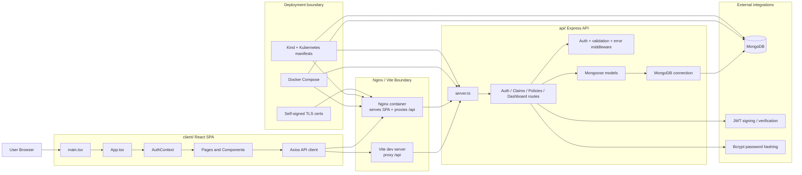

# Architecture Overview

## Project Structure

- `api/` — Express + TypeScript backend for authentication, policies, claims, dashboard reporting, and MongoDB access.
- `certs/` — Local development TLS certificates used by the production-style Nginx client container.
- `client/` — React + TypeScript frontend for login, dashboard, policy management, and claim workflows.
- `k8s/` — Kubernetes manifests for namespace, secrets, MongoDB, API, client, and Kind cluster setup.

## Boundaries & Dependencies

### Backend rules

- Route modules in `api/src/routes/` may depend on middleware, models, and config, but must not import from the React client.
- Middleware in `api/src/middleware/` may depend on Express types, shared models, and utility libraries, but must not depend on route modules.
- Models in `api/src/models/` may depend on Mongoose and other models or schemas, but must not import routes, middleware, or frontend code.
- Database config in `api/src/config/` may depend on Mongoose and environment variables only; it must not depend on routes or UI code.
- Tests in `api/src/tests/` may import routes and mock models, but production code must not depend on test files.

### Frontend rules

- Page components in `client/src/pages/` may depend on shared UI components, context, hooks, types, and API services.
- Reusable UI in `client/src/components/` may depend on context, router utilities, and types, but should not contain direct backend-only logic.
- API access in `client/src/services/` is the boundary for HTTP communication; pages and components should not create ad hoc fetch layers when the shared API client can be reused.
- Auth state belongs in `client/src/context/`; pages and components should consume auth through context instead of duplicating token state.
- Type definitions in `client/src/types/` must stay framework-light and must not import page or component modules.
- Frontend code must not import anything from `api/` directly.

### Cross-system rules

- The client talks to the backend only through HTTP requests to `/api`.
- The backend talks to persistence only through Mongoose models and MongoDB.
- Kubernetes, Docker Compose, and Nginx config orchestrate services, but application logic must not depend on container-only behavior.
- Secrets such as `JWT_SECRET` and `MONGODB_URI` must come from environment variables or deployment manifests, not hard-coded runtime imports.

### Forbidden dependencies

- UI must not import backend route handlers, models, or database config.
- Mongoose models must not import React components or browser utilities.
- Middleware must not import page components or frontend services.
- Test fixtures and mocks must not leak into runtime code paths.

## App Diagram

### Data flow summary

1. The browser loads the React SPA through Vite in development or Nginx in containerized environments.
2. The frontend stores the JWT in local storage and automatically attaches it to `/api` requests through the shared Axios client.
3. Express routes validate input, authenticate the user, and delegate persistence work to Mongoose models.
4. MongoDB stores users, policies, claims, counters, and embedded notes.
5. Docker Compose and Kubernetes provide environment wiring, networking, ports, and secrets.

## Key Components

### Backend

- **Express server** — Boots the API, wires middleware, registers routes, exposes the health endpoint, and starts listening after the database connects.
- **Authentication routes** — Register users, log users in, issue JWTs, and return the currently authenticated user.
- **Claim routes** — Create, list, update, annotate, aggregate, and delete claim records with role-aware access filtering.
- **Policy routes** — Create, list, update, retrieve, and delete policy records with owner-based authorization rules.
- **Dashboard route** — Aggregates cross-domain metrics like totals, counts by type/status, recent claims, and claim amount summaries.
- **Auth middleware** — Validates bearer tokens, loads the current user, and protects secured endpoints.
- **Validation middleware** — Converts request validation failures into predictable `400` responses.
- **Error middleware** — Centralizes API error handling at the Express boundary.
- **Mongoose models** — Define schemas for `User`, `Policy`, `Claim`, `Counter`, and embedded `Note` subdocuments.
- **Seed script** — Loads representative users, policies, claims, and counter state for demos or local testing.

### Frontend

- **React router shell** — Defines protected and public routes, including dashboard, claims, policies, login, register, and not-found views.
- **Auth context** — Owns the current token and user state, persists them to local storage, and exposes login/register/logout actions.
- **Protected route** — Blocks unauthenticated access to the main app shell and renders the navigation layout for signed-in users.
- **Pages** — Implement major business screens such as dashboard analytics, claim lists/details, and policy lists/details.
- **Shared API service** — Wraps Axios with a base URL, bearer token injection, and `401` redirect handling.

### Infrastructure

- **Docker Compose** — Runs MongoDB, API, and client together for local or production-style container workflows.
- **Nginx config** — Serves the SPA, supports client-side routing with `try_files`, and proxies `/api` traffic to the Express service.
- **Kubernetes manifests** — Define the namespace, secrets, services, deployments, storage claim, and NodePort exposure used by Kind.

## Design Principles

- **Separation by layer** — UI, API, data models, and deployment config live in distinct directories and interact through explicit boundaries.
- **HTTP as the client/server contract** — The frontend knows only the REST API surface, not backend implementation details.
- **Auth-first routing** — Most business data endpoints are protected and rely on JWT bearer tokens.
- **Role-aware data scoping** — Non-admin users are restricted to their own policies or assigned claims, while admins can view broader datasets.
- **Schema-driven validation** — Request validation happens before business logic runs, reducing invalid writes and scattered guard clauses.
- **Model hooks for generated identifiers** — Policy numbers and claim numbers are generated in Mongoose hooks rather than in route handlers; this keeps persistence rules close to the data model.
- **Single shared API client** — Frontend requests go through one Axios instance so auth headers and `401` handling stay consistent.
- **Client-side route fallback** — Nginx uses SPA-friendly routing so direct browser navigation to nested routes still loads the React app.
- **Health endpoint for orchestration** — `/api/health` exists mainly for service readiness/liveness checks in Docker and Kubernetes.
- **Notable surprise: embedded notes** — Claim notes are stored as embedded subdocuments instead of a separate top-level collection, which simplifies fetching a full claim timeline in one read.
- **Notable surprise: generated policy numbering by type/year** — Policy numbers are derived from policy type and the current year with a counter-backed sequence, not manually entered by users.

## Entry Points

### Application entry files

- Backend server entry: `api/server.ts`
- Frontend bootstrap: `client/src/main.tsx`
- Frontend route shell: `client/src/App.tsx`

### Configuration locations

- Database connection: `api/src/config/db.ts`
- Backend package and scripts: `api/package.json`
- Frontend package and scripts: `client/package.json`
- Vite dev server and test config: `client/vite.config.ts`
- Local multi-service runtime: `docker-compose.yml`
- Production-style runtime with SSL: `docker-compose.prod.yml`
- TLS certificate generation: `generate-certs.sh`
- Nginx SPA proxy config: `client/nginx.conf`
- Nginx SSL config: `client/nginx-ssl.conf`
- Kubernetes namespace and workload config: `k8s/`

### Main test suites

- Backend API route tests: `api/src/tests/api.test.ts`
- Frontend test setup and page/component tests: `client/src/tests/`

### Supporting entry-style modules

- Backend seed data runner: `api/src/seed.ts`
- Auth boundary on the client: `client/src/context/AuthContext.tsx`
- Shared HTTP client on the client: `client/src/services/api.ts`
- Protected app shell gate: `client/src/components/ProtectedRoute.tsx`
